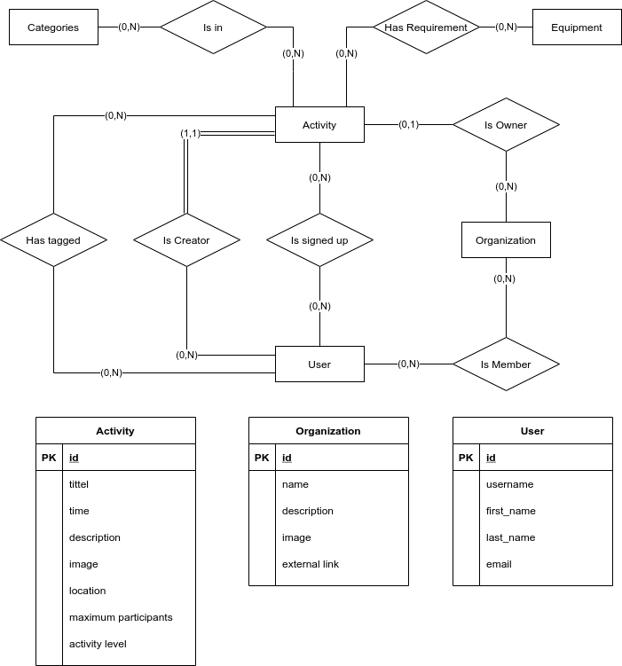

# Backend

## Packages

List of python packages used in this project:

### Production

- [Django](https://www.djangoproject.com/)
- [Django REST framework](https://www.django-rest-framework.org/)

### Development

- [flake8](https://flake8.pycqa.org/en/latest/)
- [pylint](https://www.pylint.org/)

## Structure

Outline of the most important project files:

```
.
├── api (REST API Application)
│   ├── serializers.py (Specifies how to turn models into JSON and back)
│   ├── urls.py (Where to send requests)
│   └── views.py (What to send)
├── backend (Default Application)
│   ├── settings.py (Main configuration)
│   └── urls.py (Where to send requests)
├── gjorno (Main Application)
│   ├── admin.py (Specifies the admin interface)
│   ├── models.py (Contains models for the database)
│   ├── static (Contains static files)
│   │   └── gjorno
│   │       ├── style.css
│   │       ├── example.png
│   │       └── (React files go here)
│   ├── templates (Contains html templates)
│   │   └── gjorno
│   │       └── index.html (Entrypoint for React)
│   ├── urls.py (Where to send requests)
│   └── views.py (What to send)
├── requirements_dev.txt (Python dependencies for development)
└── requirements.txt (Python dependencies for the project)
```
## Database


## REST API

`/api`

## How to develop

### Set up

Dependencies:

- [Python](https://www.python.org/)

A virtual environment is a self-contained directory tree that contains a Python
installation for a particular version of Python, plus a number of additional
packages.  
[More about virtual environments](https://docs.python.org/3/tutorial/venv.html)

Install virtualenv:  
`$ pip install virtualenv`

Create a virtual environment:  
`$ virtualenv venv`

Activate the environment:  
`$ soruce venv/bin/activate`

Install requirements for development:  
`$ pip install -r requirements_dev.txt`

Initialize database:  
`$ python manage.py migrate`

Create an admin user:  
`$ python manage.py createsuperuser --email <username>@stud.ntnu.no --username <username>`

### Workflow

Activate the environment:  
`$ source venv/bin/activate`

Run the server:  
`$ python manage.py runserver`

If the models are changed, the database must be updated:  
`$ python manage.py makemigrations`
`$ python manage.py migrate`

https://docs.djangoproject.com/en/3.1/topics/migrations/
